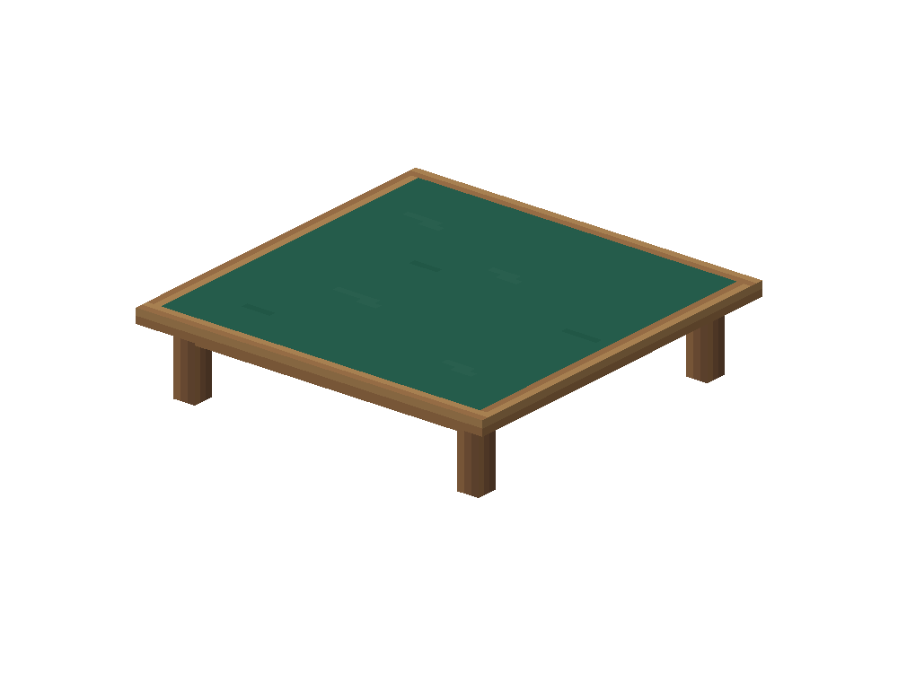
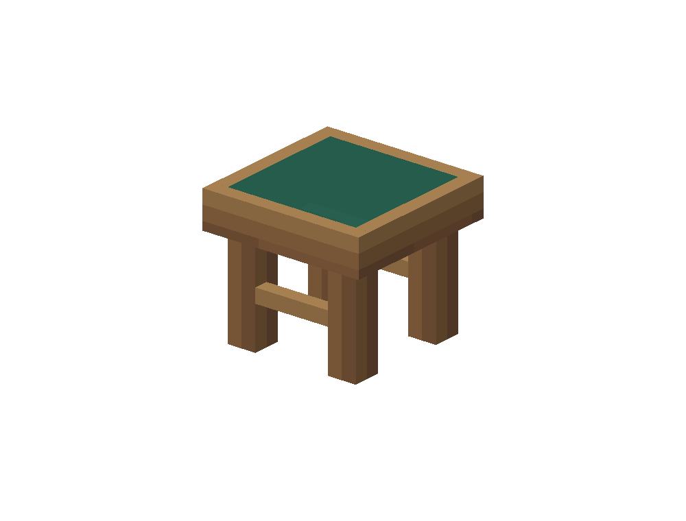

# 牌桌与无靠背凳

在 Blockbench 5.2.1 中通过 Blockbench MCP 1.10.0 制作，使用 Java Block/Item 26.3 格式。几何由原生 `place_cube` 建立，逐面 UV 由 `set_cube_uv` 设置，图集由原生矩形绘画工具绘制；工程由 `project` codec 保存，游戏 JSON 由 `java_block` codec 导出。

`table_6.bbmodel` 用于 2–6 席；`table_7.bbmodel` 至 `table_10.bbmodel` 分别对应较大的 UNO 桌。每张桌子由 13 个结构方体组成：毡面、四周木框、四条腿及四根围板。`stool.bbmodel` 包含 11 个方体：座面、木框、四腿及两根横撑。每件家具整体由一个展示实体加载。

全部工程内嵌同一张原创 128×128 图集，正式贴图在 `craftengine/cardtable/resourcepack/assets/cardtable/textures/item/furniture/furniture.png`。几何以 `[8,8,8]` 为世界地面原点，按半尺寸编码；模型 fixed 为单位变换，插件统一放大两倍，使最大桌仍满足 Java 模型 `[-16,32]` 坐标边界。模型每单位对应两个纹素，放大后为世界标准单位一个纹素，即 16 像素/格；各桌不是通过非等比拉伸同一张贴图实现。

风格遵循低元素数量、有限调色板、明确的木纹与稀疏毡面像素簇。为了精确对齐既有 0.60 格座高和牌桌高度公式，整体边界保留小数；这属于与插件布局对齐的尺寸选择，没有增加局部高分辨率细节。

已检查 Blockbench 的真实 UV 数值和前斜、后斜、侧面预览，并检查 JSON 坐标、贴图引用及导出尺寸。预览不代表 Minecraft 客户端实测；遵照用户要求不运行客户端或对局测试。

